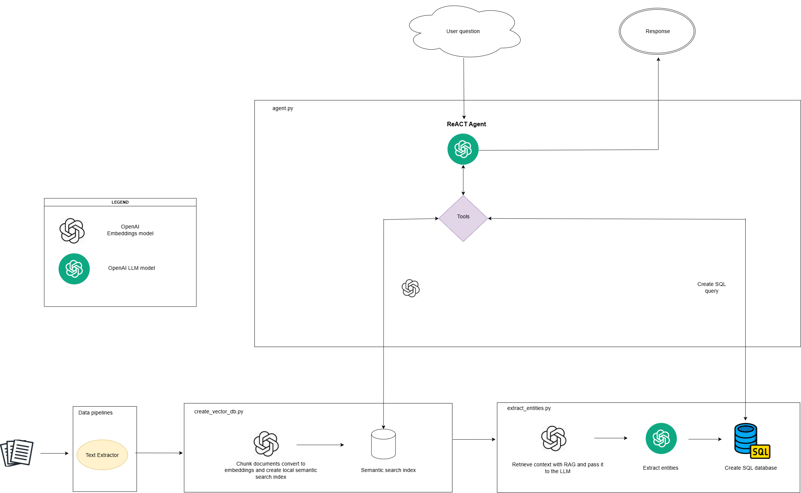

# RAG SQL Agent

[](https://opensource.org/licenses/MIT)

This agent is an OpenAI assistant that allows boosting RAG-based intelligent document assistants using entity extraction and database creation with them and SQL querying being able to answer complex multi-step questions by combining retrieval, analytical, and other tools and data sources. 

This project is based on the article https://aws.amazon.com/blogs/machine-learning/boosting-rag-based-intelligent-document-assistants-using-entity-extraction-sql-querying-and-agents-with-amazon-bedrock/ using some parts of the code but modifying others in order to use OpenAI models without cloud services.

Reading the document you will be able to understand generally this diagram that explains the basic working principle of the agent 

> 🙌 Note: This is not a production agent, this is an agent for learning purposes, some topics could be improved as the text extractor where tabular data is not extracted in the most optimal way.

Some helpers are get from the aws article repository to download and process the files.
## ⚙️ Installation
To install **rag_sql_agent** you can clone the repository and use poetry.
1. Clone the repository.

   ```ssh
   git clone https://github.com/german36-del/document_assistant_agent.git
   cd document_assistant_agent
   ```

2. Install the tool using poetry.

- Just install it.

  ```ssh
  poetry install
  ```

## 🖥️ Usage

**shopwise** can be accessed through both the Command-Line Interface (CLI) and Python code. The default parameters are configured in the `rag_sql_agent/cfg/default.yaml` file, and overwritten by the specified arguments in the CLI or Python calls.

### CLI

**rag_sql_agent** may be used directly in the Command Line Interface (CLI), with the following command format being able to override the default parameters under the `cfg/default.yaml` file as the question to formulate to the agent:

```ssh
rag_sql_agent <arg1=value2> <arg2=value2> ...
```

### Python

This tool may also be used directly in a Python environment, and it accepts the same arguments as in the CLI example above:

```python
from rag_sql_agent import rag_sql_agent

# Find the best price for your shoplist!!
rag_sql_agent(question="Tell me the 5 companies with more revenue in 2022", db_path="/temp/local_db/db_1.db")
```

Also if you want to create more sophisticated agent or a chatbot just import the module and use the ask() function:

```python
from rag_sql_agent import rag_sql_agent

# Find the best price for your shoplist!!
rag_sql_agent(question="Tell me the 5 companies with more revenue in 2022")


rag_sql_agent.ask("Which age is Jeff Bezos")
```

